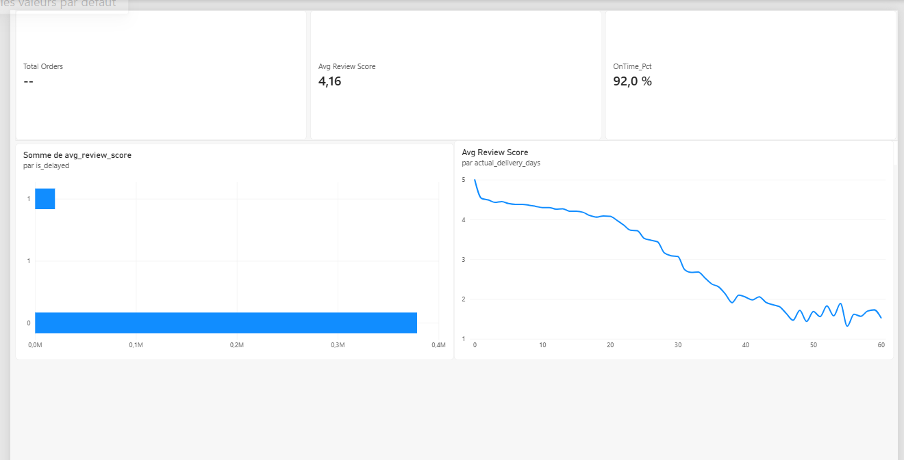

# 🚚 Supply Chain & Delivery Performance Analysis

## Executive Summary
This project analyzes over 99,000 real e-commerce delivery records to assess the operational impact of shipping delays on customer satisfaction. Using SQL Server (T-SQL) for data modeling and Power BI for interactive visualization, the study demonstrates how delivery bottlenecks directly correlate with lower customer review scores.

## Key Insights
* **Overall On-Time Delivery Rate:** 92.0% of orders are delivered within the estimated timeframe.
* **Customer Satisfaction Drop:** On-time orders average a customer satisfaction score of **4.29 / 5**, whereas delayed orders experience a severe decline to **2.57 / 5** (a 40% decrease).
* **Delivery Latency Correlation:** Customer reviews steadily deteriorate once shipping transit time exceeds 15 days, reaching bottom satisfaction levels after 30 days.

## Business Recommendations
1. **Dynamic Delivery Estimates:** Adjust estimated delivery time algorithms dynamically based on regional carrier performance to prevent false expectations.
2. **Automated Delay Recovery:** Implement automated status notifications and proactive compensation vouchers for any shipment exceeding 14 transit days before customer reviews are requested.
3. **Logistics SLA Review:** Re-negotiate performance level agreements with underperforming regional logistics partners responsible for long-tail transit times.

## Tech Stack
* **Database & Querying:** Microsoft SQL Server (T-SQL, CTEs, Aggregations, Views)
* **Business Intelligence:** Microsoft Power BI Desktop (DAX Measures, Data Modeling)
